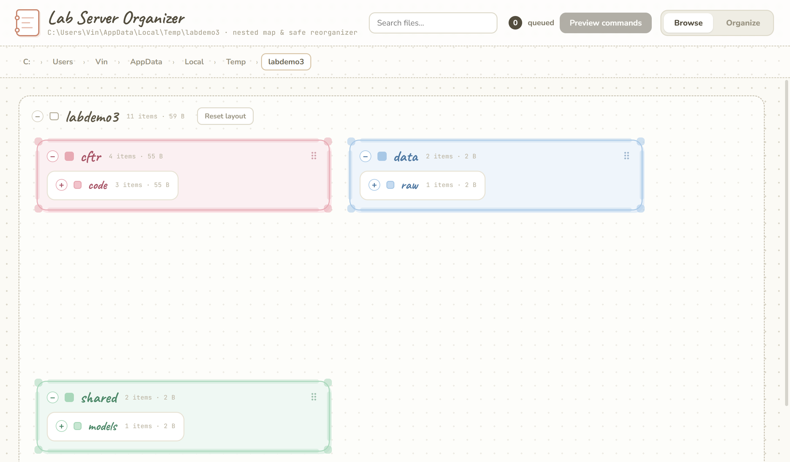
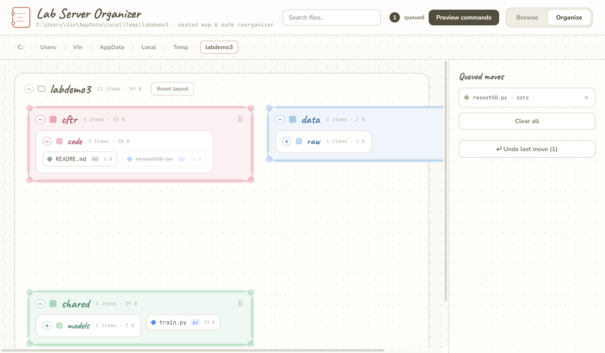
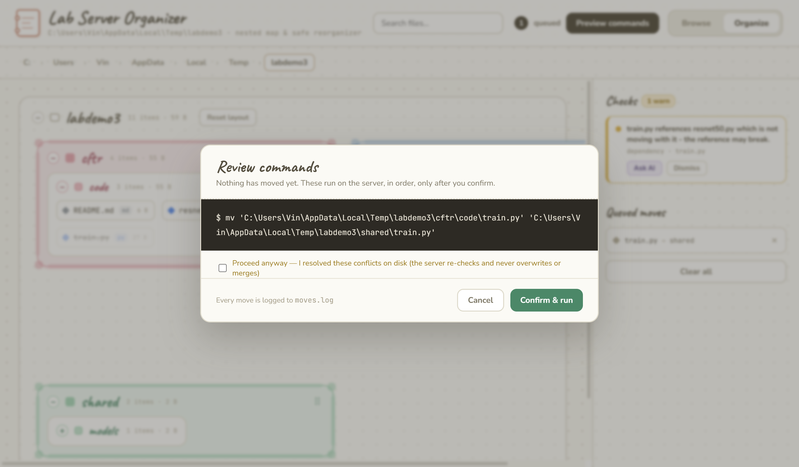
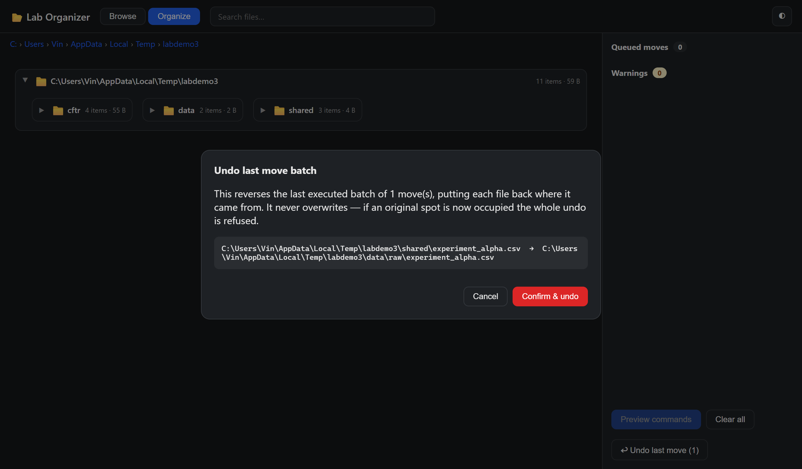

<p align="center">
  
</p>

<p align="center">
  <a href="https://github.com/Vin124/lab-organizer/actions/workflows/ci.yml"></a>
  <a href="LICENSE"></a>
  
  <a href="https://github.com/astral-sh/ruff"></a>
</p>

# Lab Server File Organizer

A self-hosted web tool to **see** and **safely reorganize** files scattered across
a shared lab server. Two modes:

- **Browse** — a nested rounded-rectangle map of the directory tree. Click any
  folder to expand it *in place* (zoom-in-place); the rest of the layout reflows
  around it. Folder sizes and item counts are shown for context.
- **Organize** — drag files **and whole folders** to new homes. Nothing moves
  until you preview the exact `mv` commands and confirm. Splitting a file from
  something it depends on raises a warning you can dismiss or ask the AI about.
  Changed your mind? **Undo last move** reverses the most recent executed batch
  (with the same confirm + never-overwrite guarantees).
- **Search** — a name search across the whole tree; click a hit to jump to it in
  Browse and highlight it.

Nothing is ever moved or deleted without explicit confirmation, every executed
move is re-validated server-side and written to an append-only audit log, and the
tool works fully with no AI key.

## Install

```bash
python -m venv .venv && source .venv/bin/activate   # Windows: .venv\Scripts\activate
pip install -r requirements.txt
cp .env.example .env        # then edit LAB_ROOT
```

## Run

```bash
export LAB_ROOT=/home               # the directory you want to organize
uvicorn backend.main:app --host 127.0.0.1 --port 8000
# open http://127.0.0.1:8000
```

Everything is configured by environment variable (see `.env.example`):

| Var | Default | Meaning |
|-----|---------|---------|
| `LAB_ROOT` | `/home` | Allowlisted root. Any path resolving outside it is rejected. |
| `ANTHROPIC_API_KEY` | _(unset)_ | Enables the AI advisor. Optional. |
| `READ_ONLY` | `false` | When true, all move/execute endpoints return 403 (browse-only). |
| `AUTH_TOKEN` | _(unset)_ | When set, every request needs HTTP Basic auth (password = this value). Off by default. |
| `RATE_LIMIT` | `0` | Requests per 60s per client IP; `0` disables. A courtesy guard for a directly exposed instance — real throttling belongs at a proxy. |
| `PATH_PRIVACY` | `false` | When true, the API returns paths **relative** to `LAB_ROOT` so absolute server paths aren't leaked to the client. Off by default. |
| `MAX_CHILDREN` | `500` | Per-dir cap before the tree reports `truncated` (paged via `offset`). |
| `BIND_HOST` / `BIND_PORT` | `127.0.0.1` / `8000` | Where to listen. |
| `MOVES_LOG` | `moves.log` | Append-only audit log path. |

## Screenshots

The UI is a paper-notebook design (depth-palette nested cards on dotted paper, free-drag/
resize project cards), run against a real lab tree:

| Browse (nested palette cards) | Organize (rail + queued moves) |
|---|---|
|  |  |

| Command preview (exact `mv`) | Undo last batch (confirm) |
|---|---|
|  |  |

The move flow above is real: dragging `train.py` away from the `resnet50.py` it
imports raised the dependency warning, the preview showed the exact shell-quoted
`mv`, and confirming moved the file on disk, appended an audit-log line, and toasted
"Moved 1 item · logged". (Earlier-design captures: `docs/screenshots/01-04`.)

## Deploy

Production posture: **bind to localhost, reach it over SSH**, run under a process
manager so it restarts on boot/crash. Two common setups:

### Quick (uvicorn under SSH tunnel)

On the lab server:

```bash
cd /opt/lab-organizer
python -m venv .venv && .venv/bin/pip install -r requirements.txt
LAB_ROOT=/home READ_ONLY=false \
  .venv/bin/uvicorn backend.main:app --host 127.0.0.1 --port 8000
```

From your laptop:

```bash
ssh -L 8000:127.0.0.1:8000 you@lab-server   # then open http://127.0.0.1:8000
```

### systemd (survives reboots)

`/etc/systemd/system/lab-organizer.service`:

```ini
[Unit]
Description=Lab Server File Organizer
After=network.target

[Service]
User=lab
WorkingDirectory=/opt/lab-organizer
Environment=LAB_ROOT=/home
Environment=READ_ONLY=false
# Optional shared-token gate (see Authentication). Leave unset for none.
# Environment=AUTH_TOKEN=replace-with-a-long-random-string
# Optional AI advisor:
# Environment=ANTHROPIC_API_KEY=sk-ant-...
ExecStart=/opt/lab-organizer/.venv/bin/uvicorn backend.main:app --host 127.0.0.1 --port 8000
Restart=on-failure

[Install]
WantedBy=multi-user.target
```

```bash
sudo systemctl daemon-reload
sudo systemctl enable --now lab-organizer
sudo systemctl status lab-organizer          # check it's up
curl -s http://127.0.0.1:8000/healthz        # -> {"status":"ok"}
journalctl -u lab-organizer -f               # logs
```

Keep `--host 127.0.0.1`: it stays reachable only through the SSH tunnel. To expose
it on a network, front it with a reverse proxy that terminates TLS + auth (or set
`AUTH_TOKEN` for a quick shared-token gate, and/or `READ_ONLY=true` for a safe
shared view). The audit log (`MOVES_LOG`, default `moves.log` in the working dir)
is append-only — point it at durable storage you back up.

### Docker

The image is self-contained (the frontend is static — no build step):

```bash
docker build -t lab-organizer .

# Browse-only (read-only mount + READ_ONLY), published to localhost only:
docker run --rm -p 127.0.0.1:8000:8000 \
  -v /srv/lab:/data:ro -e READ_ONLY=true lab-organizer

# Full organize (writable mount), with optional hardening:
docker run --rm -p 127.0.0.1:8000:8000 \
  -v /srv/lab:/data \
  -e AUTH_TOKEN="$(openssl rand -hex 24)" \
  -e RATE_LIMIT=120 -e PATH_PRIVACY=1 \
  lab-organizer
```

`LAB_ROOT` defaults to `/data` inside the image; mount the directory you want to
organize there. The container binds `0.0.0.0` internally, so **publish only to
`127.0.0.1`** on the host (as above) to keep the localhost posture. It runs as a
non-root user.

## API

| Endpoint | Purpose |
|----------|---------|
| `GET /api/config` | Server flags (root, read-only, ai-enabled). |
| `GET /api/tree?path=&depth=` | Directory scan as nested JSON (recursive size/count). |
| `GET /api/tree/expand?path=&offset=` | Lazily load one more level; `offset` pages a truncated dir's remaining children. |
| `GET /api/dir-stats?path=` | Recursive size + item_count for one dir, fetched lazily so the tree renders before sizes. |
| `POST /api/analyze-moves` | Dependency + collision warnings for a proposed move plan. |
| `POST /api/preview-moves` | The literal `mkdir`/`mv` commands that *would* run. |
| `POST /api/execute-moves` | Runs the plan — **requires `confirmed: true`**; re-validates first. Never overwrites/merges. |
| `GET /api/undo-info` | Describes the most recent undoable batch (count + reverse moves). |
| `POST /api/undo` | Reverses the last executed batch — **requires `confirmed: true`**; never overwrites. |
| `GET /api/search?q=&path=` | Case-insensitive name search under `LAB_ROOT`, bounded by depth/result caps. |
| `POST /api/ask-ai` | Optional AI guidance about a move plan / warning. |

The client only ever proposes `{src, dst}` pairs. **The server builds and runs the
commands** — arbitrary client commands are never executed.

## Security & safety

- **Path allowlist.** Every client path is resolved (symlinks + `..`) and rejected
  if it escapes `LAB_ROOT`. Symlinks pointing outside the root are caught. See
  `backend/safety.py` and `tests/test_safety.py`.
- **Confirmation required.** `execute-moves` is a no-op without `confirmed: true`.
- **Never overwrites or merges.** If anything already exists at a destination, that
  move fails loud — the tool will not clobber a file or merge into a folder. Rename
  or pick another destination. `force: true` only lets you retry a plan whose
  conflicts you've cleared on disk (the server re-validates); it can never overwrite.
- **Re-validation at execute time.** The plan is re-checked against the live
  filesystem immediately before moving — the client's view is never trusted.
- **Fail loud.** A batch stops on the first failed move and reports exactly what
  succeeded and what didn't; it never half-finishes silently.
- **Audit log.** Every executed move (and failure) is appended to `MOVES_LOG`. Path
  fields are escaped (tab/newline → `\t`/`\n`) so a crafted filename can't forge a
  log record or redirect `undo` — see `_enc`/`_dec` in `backend/moves.py`.
- **Read-only mode.** `READ_ONLY=true` disables all write endpoints entirely.
- **Undo serialization.** Move execution and undo take a process lock so concurrent
  requests can't interleave or double-undo a batch.

### Authentication

The default bind is **localhost only** — access it over an SSH tunnel:

```bash
ssh -L 8000:127.0.0.1:8000 you@lab-server
```

For a quick shared-token gate without a proxy, set `AUTH_TOKEN`:

```bash
export AUTH_TOKEN="$(openssl rand -hex 24)"
uvicorn backend.main:app --host 127.0.0.1 --port 8000
```

When set, every request requires HTTP Basic auth — the browser prompts once and
caches it; enter **any username** and the token as the password. `/healthz` stays
open for liveness checks. Unset `AUTH_TOKEN` (the default) means no auth, preserving
the localhost contract.

This is a thin convenience seam, not a full auth system (no user accounts in v1).
For real multi-user or network exposure, terminate auth at a reverse proxy (nginx
basic-auth / your SSO) and/or set `READ_ONLY=true` for a safe shared view.

### Threat model & network exposure

The default posture is **localhost + SSH tunnel**, single trusted user. If you must
expose the instance more directly, two opt-in knobs reduce the blast radius (both
off by default, neither replaces a proxy):

- **`PATH_PRIVACY=1`** makes the API return paths **relative** to `LAB_ROOT`, so the
  client never sees absolute server paths (e.g. `code/train.py`, not
  `/srv/lab/.../code/train.py`). The server still re-anchors those relative paths
  under `LAB_ROOT` via `safe_resolve` on the way back in, so the move/undo contract
  is unchanged. Mitigates information disclosure about the host's layout.
- **`RATE_LIMIT=N`** caps requests per 60s per client IP (a simple in-process
  fixed-window limiter). It throttles abusive scans and brute-force auth attempts on
  a single instance, but it is **not** distributed — behind multiple workers or a
  load balancer, throttle at the proxy instead. Client IP is taken from the socket,
  so put a trusted proxy in front if you rely on `X-Forwarded-For`.

What is still **out of scope** for v1 and belongs at a reverse proxy / the OS:
TLS termination, real user accounts/RBAC, CSRF tokens (the API is same-origin and
unauthenticated by default), and per-user authorization. The server runs with the
privileges of its OS user — scope `LAB_ROOT` and the unix account accordingly.

## Performance (large trees)

The tree endpoints return **structure only** — recursive folder sizes are computed
lazily via `/api/dir-stats` as nodes become visible, so a deep/wide scan never blocks
on sizing the whole tree. Benchmark it against a real directory:

```bash
python scripts/bench_tree.py /some/big/dir --depth 3
```

Measured on a real `~/Documents` tree (3,283 nodes, depth 3): **lazy scan ~0.49s vs
eager full-size scan ~36.5s — ~75× faster** on the path that renders the UI. Sizes
then stream in per folder (mtime-cached, so repeats are instant). For very large
roots the root's own recursive size still takes a while, but it fills in *after* the
tree is interactive rather than blocking it.

## Tests

```bash
python -m pytest tests/ -q          # unit + integration (e2e excluded by default)
ruff check backend/ tests/ scripts/
```

The highest-value tests cover the dangerous areas: path safety
(`test_safety.py`), dependency detection (`test_deps.py`), command generation +
execution safety (`test_moves.py`), undo safety + audit-log injection
(`test_undo.py`), search bounds/escape (`test_search.py`), and the
rate-limit/path-privacy hardening (`test_hardening.py`).

A Playwright **end-to-end** test (`tests/e2e/`) drives the real browser through the
whole move flow (Browse → drag → warning → preview → execute → verify). It's
excluded from the default run; run it with a browser installed:

```bash
pip install pytest-playwright && playwright install chromium
pytest -m e2e -q
```

CI (`.github/workflows/ci.yml`) runs ruff + pytest on every push, plus the e2e job.

## Layout

```
backend/   FastAPI app (main), tree scan, deps detection, moves (+undo), safety,
           config, ai, auth, ratelimit, privacy
frontend/  zero-build single-page app (index.html + ES modules; browse/organize/search)
tests/     safety / deps / moves / tree / auth / undo / search / ai / hardening / e2e
```

## Changelog

- **v3** — Undo last batch; a genuinely useful AI advisor; tree-wide search;
  network-exposure hardening (opt-in `RATE_LIMIT` + `PATH_PRIVACY`); Dockerfile,
  GitHub Actions CI, and a Playwright E2E test.
- **v2** — Click-to-load truncated dirs; optional `AUTH_TOKEN` gate; lazy
  non-blocking tree sizing; real-directory deploy + screenshots.
- **v1** — Browse + Organize end to end: nested zoom, drag files/folders,
  dependency + collision warnings, command preview, confirmed execute, audit log.

## Contributing

Contributions are welcome — see [CONTRIBUTING.md](CONTRIBUTING.md) for setup,
the test/lint commands, and the safety invariants every PR must preserve.
Please report security issues privately per [SECURITY.md](SECURITY.md), and be
excellent to each other per the [Code of Conduct](CODE_OF_CONDUCT.md).

## License

[MIT](LICENSE) © 2026 Vin124
